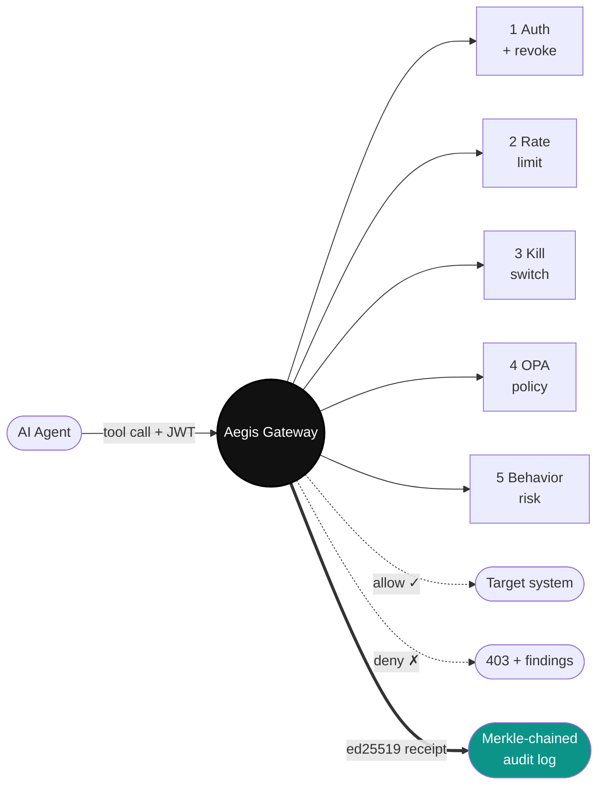

<h1>Abhishek Mishra</h1>

  <b>Runtime security for autonomous AI agents.</b> 
  AI Infrastructure Engineer at <b>ByteHubble.ai</b> · Hyderabad, India

  
  
  
  
  

---

I build the runtime layer that decides which actions an AI agent can take, blocks the ones that shouldn't run, and produces a cryptographically verifiable record of everything that happened. One problem, at production quality.

## 🛡 Currently building — Aegis

  
  
  

Runtime security control plane. Sits between an AI agent and every system it can act on. Every tool call is authenticated, policy-checked (OPA/Rego), risk-scored, and cryptographically signed **before** it executes.

**[Live](https://aegisagent.in)** · **[Source](https://github.com/Abhi-mishra998/aegis)** · **[Engineering deep-dive](https://projectsphere.hashnode.dev/i-built-a-runtime-firewall-for-ai-agents)** · **[5-min walkthrough](https://drive.google.com/file/d/1Eojid76NcrRLC1Gp302i113pNgrH1hso/view)**

**Design choices worth reading about, not just claiming**

- **Why ed25519 over RSA** — 64-byte signatures, deterministic, no padding-oracle exposure. Verifier needs only the public key. Post: [ed25519 vs RSA on the audit hot path](https://projectsphere.hashnode.dev/i-built-a-runtime-firewall-for-ai-agents).
- **Why the kill switch dual-writes Redis + Postgres** — Redis is hot-path speed. Postgres is durability. I flushed Redis mid-incident during chaos testing; the agent stayed blocked because the next request rehydrated from Postgres.
- **Why 16 HMAC shard chains, not one** — Single-chain tip becomes the write bottleneck at load. The daily Merkle root reduces 16 tips into one signed digest, so verification stays cheap.
- **Why fail-closed is the default at every gate** — An unreachable dependency returns 5xx, never falls through to allow. Denial correctness is a load-bearing invariant, not a courtesy.

`< 30 ms p95` on the deny path · `12 microservices` · `SDKs for Anthropic, OpenAI, LangChain, Bedrock` on PyPI · aligned to **OWASP Agentic Top-10** and drafted against **EU AI Act** operator controls.

---

## Two other systems I ship

**[Revora](https://github.com/Abhi-mishra998/revenue-recovery-os)** — Revenue Recovery OS for Indian B2B services. Signed audit chain on every write. Postgres Row-Level Security for tenant isolation. PII redact-before-LLM. Value-tier model routing (Haiku for cheap proposals, stronger models for high-value). DPDP-compliant export + delete. In beta with ByteHubble + one external partner. [Live](https://revenue-recovery-os1.vercel.app) · [90-sec demo](https://drive.google.com/file/d/1fYYko3czhO7s8P7IijeGuUOexBnRzTzw/view).

**[ZyntraOps](https://github.com/Abhi-mishra998/ZyntraOps)** — Autonomous SRE for Kubernetes. Hybrid pipeline: deterministic rules for `CrashLoopBackOff` / `OOMKilled` / `ImagePullBackOff`, LLM reasoning for the tail. Bounded rollback, human approval for cluster-scoped ops. Related work: [SentinelOps](https://github.com/Abhi-mishra998/SentinelOps), [Astrixion](https://github.com/Abhi-mishra998/Astrixion).

---

## Stack

  &nbsp;
  &nbsp;
  &nbsp;
  &nbsp;
  &nbsp;
  &nbsp;
  &nbsp;
  &nbsp;
  &nbsp;
  &nbsp;
  &nbsp;
  

**Systems** Python · FastAPI · PostgreSQL (RLS · pgvector · HMAC chains) · Redis · OPA/Rego · ed25519 · Merkle trees  
**Cloud** AWS (EC2 · ALB · RDS Multi-AZ · ElastiCache · KMS · WAFv2 · CloudTrail · SSM · Secrets Manager)  
**Infra & CI** Terraform · Docker · Kubernetes · GitHub Actions · Trivy · Checkov · Bandit  
**Observability** Prometheus · Grafana · Jaeger · OpenTelemetry · structlog

---

## Experience

| When | Where | What |
|---|---|---|
| Jul 2025 – Present | AI Infrastructure Engineer, **ByteHubble.ai** · Hyderabad · On-site | Architected and shipped Aegis. Own backend services, APIs, and cloud infra for production customer + internal platforms. |
| Mar 2026 – Present | **AWS Community Builder** · AI Engineering | Contributions to cloud infra + agent security community. |
| Jul 2024 – Jul 2025 | AI Engineer Intern, **ByteHubble.ai** · Remote | Built AI features + backend services on Python / FastAPI / Postgres / AWS. |
| 2021 – 2025 | B.Tech (Hons) IT, **Panipat Institute of Engineering & Technology**, Kurukshetra University · CGPA 8.2 | Class Representative × 4 years · Technical Event Head · 20+ NPTEL credits from IIT-run CS courses |

---

## Recognition

**AWS Community Builder** (AI Engineering) · **$500 community-builders grant** for Aegis · **$300 AWS League ML prize** · **AWS startup credits** · **NPTEL Discipline Star** — IIT Madras (Top Performer) · **Oracle Certified Associate** (OCI Foundations) · **HCL GUVI Advanced DevOps & Cloud, Grade A** · **Outstanding Student Leadership Award** — PIET.

> *"Great learner, someone can definitely rely on and take him to the team. I vouch for him."*  
> — **Sourav Saha**, Manager, IT Infrastructure & Cloud Ops at MSM Unify · 21× Microsoft & AWS Certified

---

## Read · watch · contact

- **Writing** — [projectsphere.hashnode.dev](https://projectsphere.hashnode.dev) — engineering deep-dives on ed25519 vs RSA, chaos-testing kill switches, cost-optimizing early-stage AWS
- **Video** — [Aegis 5-min walkthrough](https://drive.google.com/file/d/1Eojid76NcrRLC1Gp302i113pNgrH1hso/view) · [Aegis feature reel](https://drive.google.com/drive/folders/1cAnCFmF6SEqaqTbiijuj0HyGwXmy1lhZ) · [Revora 90-sec](https://drive.google.com/file/d/1fYYko3czhO7s8P7IijeGuUOexBnRzTzw/view)
- **LinkedIn** — [linkedin.com/in/abhishek-mishra-eng](https://www.linkedin.com/in/abhishek-mishra-eng/) · build-in-public, 3,100+ followers
- **Portfolio** — [portfolio-self-seven-1zphd40voq.vercel.app](https://portfolio-self-seven-1zphd40voq.vercel.app)
- **GitHub** — [github.com/Abhi-mishra998](https://github.com/Abhi-mishra998) · 76 public repos
- **Email** — [abhishekmishra09896@gmail.com](mailto:abhishekmishra09896@gmail.com)

**Open to** senior AI Engineering / AI Infrastructure / Platform Engineering / Backend Engineering roles. On-site · Hybrid · Remote. Hyderabad-based, willing to relocate for the right team.
